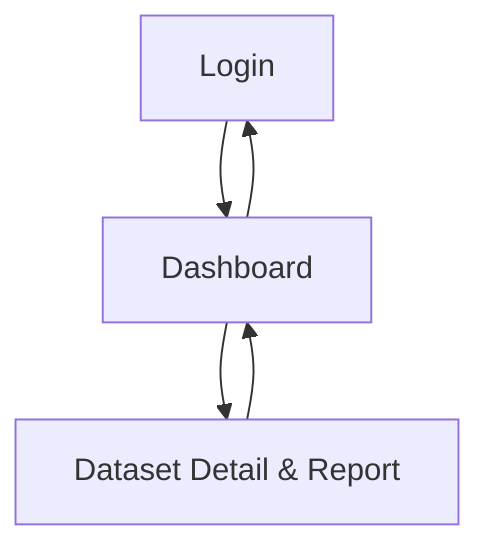

## 1. Product Overview

A hybrid (Web + Desktop) analytics app that lets you upload a CSV, sends it to a backend for processing, and displays summary analytics as charts and tables.
Includes basic authentication, a last-5 dataset history, and one-click PDF report generation.

## 2. Core Features

### 2.1 User Roles

| Role | Registration Method | Core Permissions                                                                    |
| ---- | ------------------- | ----------------------------------------------------------------------------------- |
| User | Email + password    | Log in, upload CSV datasets, view last-5 history, view analytics, export PDF report |

### 2.2 Feature Module

Our requirements consist of the following main pages:

1. **Login**: sign in form, session handling, sign out.
2. **Dashboard**: CSV upload, processing status, last-5 dataset history, quick summary charts/tables.
3. **Dataset Detail & Report**: full analytics charts/tables, dataset metadata, PDF report generation/download.

### 2.3 Page Details

| Page Name               | Module Name                 | Feature description                                                                                                                                                           |
| ----------------------- | --------------------------- | ----------------------------------------------------------------------------------------------------------------------------------------------------------------------------- |
| Login                   | Sign in                     | Authenticate with email + password; show validation errors; persist session on success.                                                                                       |
| Login                   | Sign out                    | End session and return to Login.                                                                                                                                              |
| Dashboard               | CSV upload                  | Select or drag/drop a single CSV; validate file type/size; upload to backend; show upload + processing progress and final status.                                             |
| Dashboard               | Recent history (last-5)     | List the last 5 uploaded datasets for the signed-in user (most recent first); show name, upload time, and processing status; open a dataset in detail view.                   |
| Dashboard               | Quick analytics preview     | Show backend-provided summary analytics for the currently selected/most recent dataset using charts + tables; show empty state when none exists.                              |
| Dataset Detail & Report | Dataset overview            | Display dataset metadata (filename, upload time, row/column counts) and processing state; allow returning to Dashboard.                                                       |
| Dataset Detail & Report | Analytics (charts + tables) | Fetch and render summary analytics API response; provide table view for key metrics; provide chart view for distributions/trends where applicable; show loading/error states. |
| Dataset Detail & Report | PDF report                  | Generate a PDF report for the dataset via backend; download/open the PDF; show generation progress and errors.                                                                |

## 3. Core Process

**User Flow**

1. You open the app (web or desktop) and log in with email and password.
2. You upload a CSV from the Dashboard.
3. The backend stores the dataset and computes summary analytics.
4. You see the dataset appear in your last-5 history and can select it.
5. You view charts/tables on the Dashboard preview or open the Dataset Detail page for full analytics.
6. You generate and download a PDF report for the dataset.

