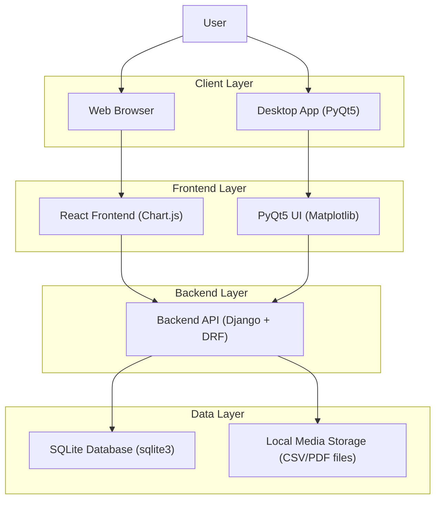
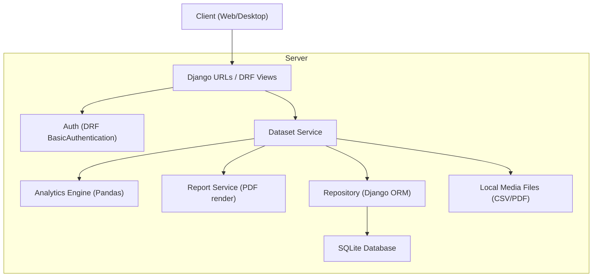
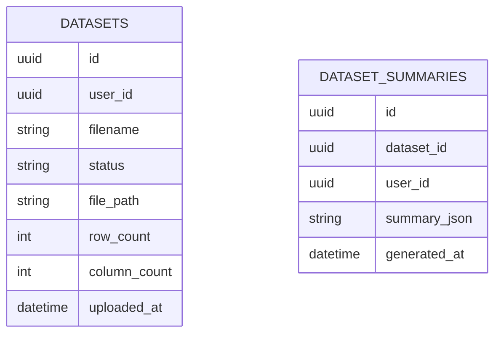

## 1.Architecture design


## 2.Technology Description
- Frontend (Web): React.js + Chart.js (tables + charts)
- Frontend (Desktop): PyQt5 + Matplotlib (tables + charts)
- Backend: Python Django + Django REST Framework (CSV ingest, analytics computation, PDF generation)
- Data handling: Pandas
- Database: SQLite (via Python `sqlite3`, managed through Django ORM)

## 3.Route definitions
| Route | Purpose |
|-------|---------|
| /login | Sign in UI and session bootstrap |
| /dashboard | CSV upload, last-5 datasets list, quick analytics preview |
| /datasets/:id | Full analytics view and PDF report actions |

## 4.API definitions (If it includes backend services)

### 4.1 Core API

Upload CSV dataset
```
POST /api/datasets/upload/
```
Request (multipart/form-data):
| Param Name | Param Type | isRequired | Description |
|-----------|------------|------------|-------------|
| file | File | true | CSV file to upload (stored as a dataset record in SQLite; parsed with Pandas for analytics) |

Response:
| Param Name | Param Type | Description |
|-----------|------------|-------------|
| dataset | Dataset | Created dataset record |

List last-5 datasets (per signed-in user)
```
GET /api/datasets/?limit=5
```
Response:
| Param Name | Param Type | Description |
|-----------|------------|-------------|
| items | Dataset[] | Most recent datasets |

Get summary analytics for a dataset
```
GET /api/datasets/:id/summary/
```
Response:
| Param Name | Param Type | Description |
|-----------|------------|-------------|
| summary | SummaryAnalytics | Summary analytics payload |

Generate/download PDF report for a dataset
```
GET /api/datasets/:id/report.pdf
```
Response:
- Content-Type: application/pdf
- Body: PDF binary

Auth mechanism (basic auth requirement)
- Both web and desktop clients call the API using HTTP Basic Auth.
- Clients send `Authorization: Basic <base64(username:password)>` on every request.
- Backend uses Django auth + DRF BasicAuthentication to identify the user and scope dataset access.

## 5.Server architecture diagram (If it includes backend services)


## 6.Data model(if applicable)

### 6.1 Data model definition


Local storage:
- Raw uploaded CSV and generated PDF files can be stored on the local filesystem (Django `MEDIA_ROOT`), while dataset metadata and summaries are stored in SQLite.

### 6.2 Data Definition Language
Note: In the actual implementation, Django migrations will generate the SQLite schema. The simplified SQLite DDL below is for reference.

Datasets Table (datasets)
```
CREATE TABLE datasets (
  id TEXT PRIMARY KEY,
  user_id INTEGER NOT NULL,
  filename TEXT NOT NULL,
  status TEXT NOT NULL,
  file_path TEXT,
  row_count INTEGER,
  column_count INTEGER,
  uploaded_at TEXT NOT NULL
);

CREATE INDEX idx_datasets_user_uploaded_at ON datasets (user_id, uploaded_at DESC);
```

Dataset Summaries Table (dataset_summaries)
```
CREATE TABLE dataset_summaries (
  id TEXT PRIMARY KEY,
  dataset_id TEXT NOT NULL,
  user_id INTEGER NOT NULL,
  summary_json TEXT NOT NULL,
  generated_at TEXT NOT NULL,
  FOREIGN KEY(dataset_id) REFERENCES datasets(id)
);

CREATE INDEX idx_summaries_dataset_id ON dataset_summaries (dataset_id);
CREATE INDEX idx_summaries_user_generated_at ON dataset_summaries (user_id, generated_at DESC);
```

Notes:
- The backend should enforce “last-5 history” by querying `datasets` for the current user ordered by `uploaded_at DESC` with `LIMIT 5`.
- CSV parsing, analytics computation, and PDF generation run in backend code so both web and desktop clients behave consistently.
